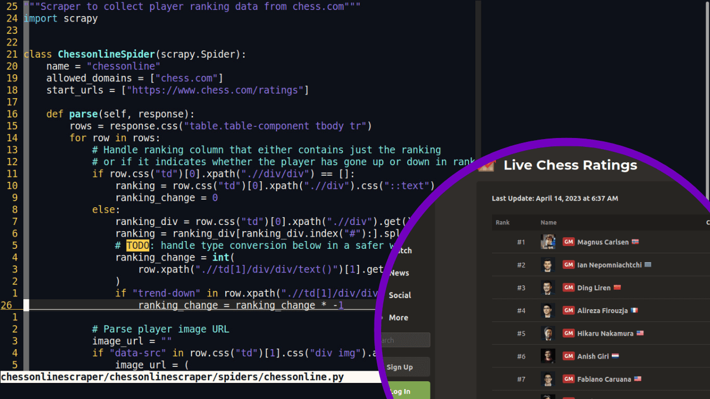

# Chess Online Website Scraper
This is a simple web scraper built using the Scrapy framework. It is designed to scrape data from the Chess Online website.
Scraped data will be used in an interactive web app.

## Requirements
Python 3.11.1
Scrapy

## Installation
- Clone this repository to your local machine
- Install the required dependencies by running `pipenv install`
- Run the main spider using the command `scrapy crawl chessonline -O chessonline_rankings.json`
- Running the other two spiders will allow you to distiguish the other player categories: women and under 20 players

## Contributing
If you find any issues or bugs in this project, please feel free to open an issue or submit a pull request
